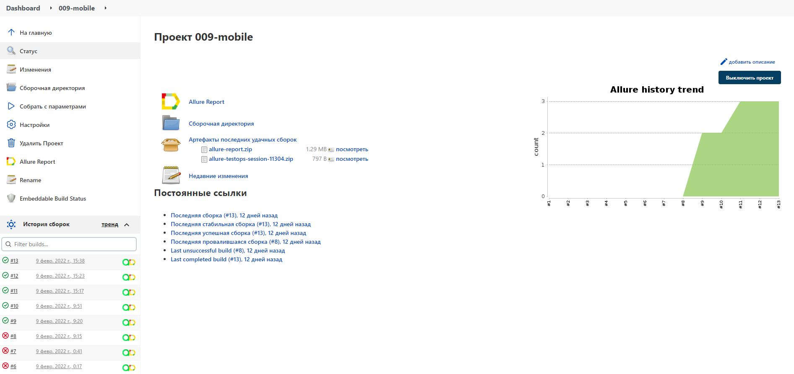
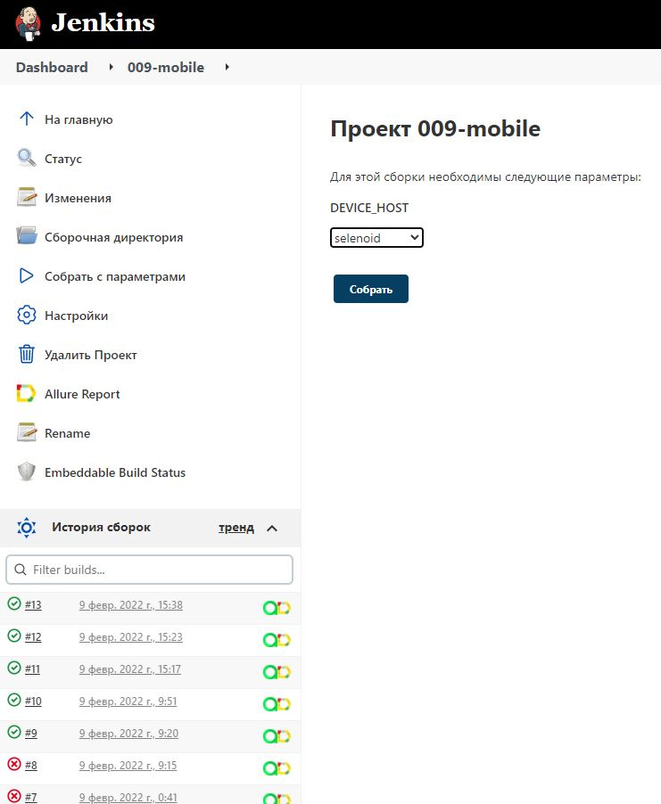
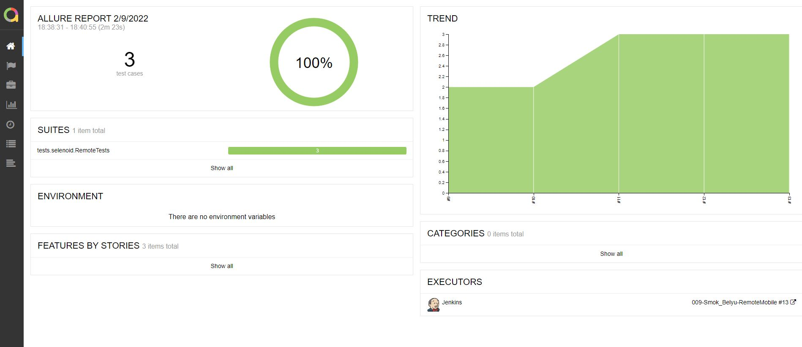
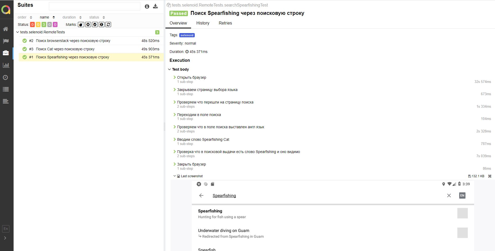
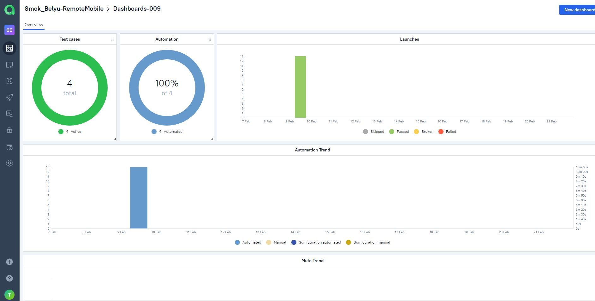
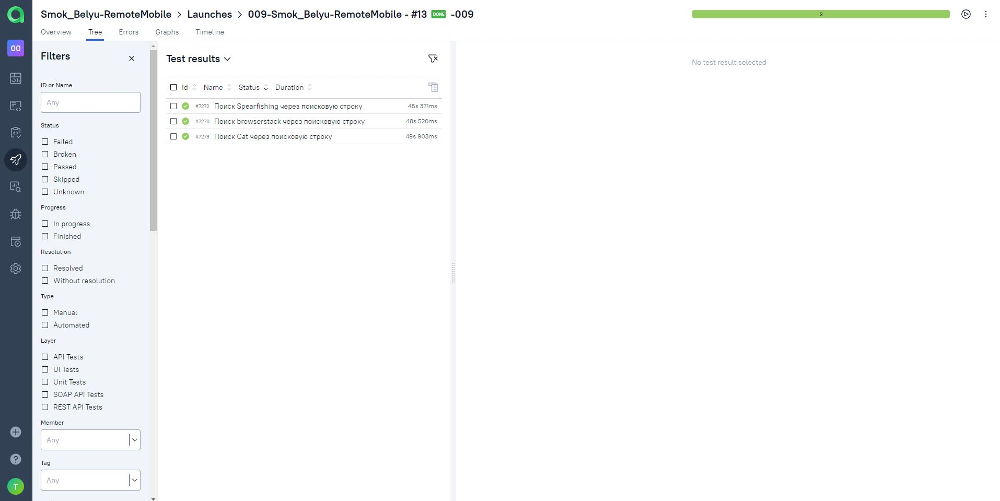
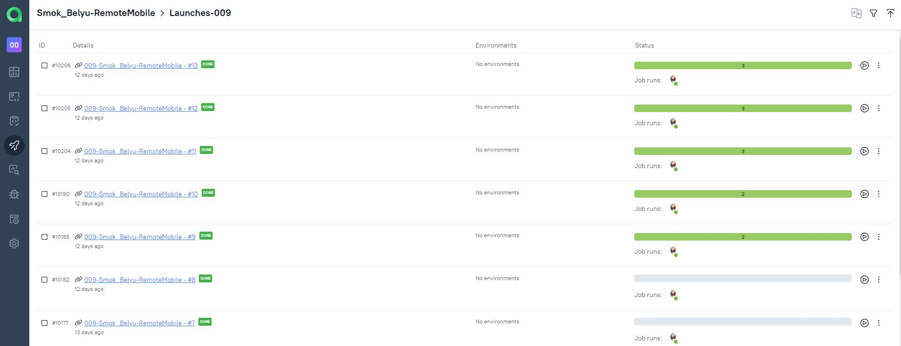
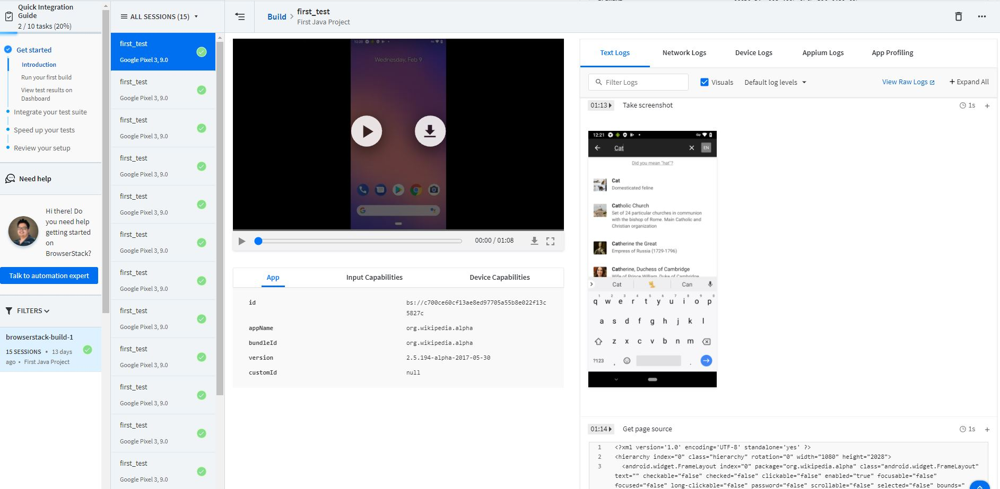
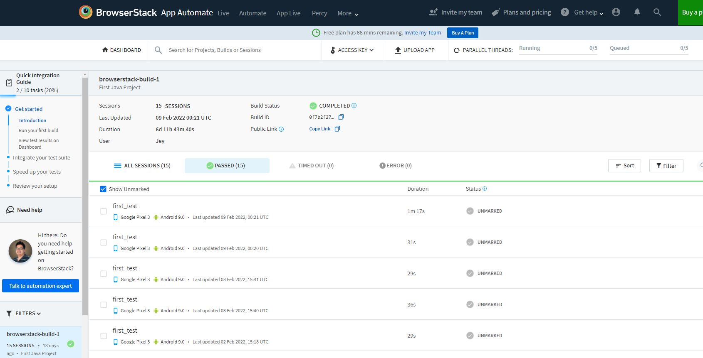
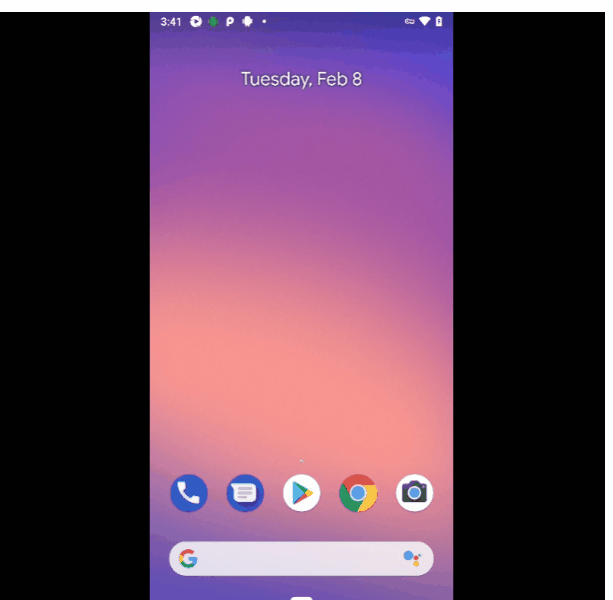

# The test automation project for mobile App
<p align="center">
  
</p>

___
## The project technologies:


___

## Run tests from terminal locally

### Run tests on Browserstack:

```bash
gradle clean test -DdeviceHost=browserstack
```

### Run tests on Selenoid:

```bash
gradle clean test -DdeviceHost=selenoid
```

### Serve report:

```bash
allure serve build/allure-results
```

___

## Results

The test results can be found in:
+ [Jenkins](#jenkins)
+ [Allure Report](#allure-report)
+ [Allure TestOps](#allure-testOps)
+ [Browserstack](#browserstack)


### Jenkins

[Jenkins job](https://jenkins.autotests.cloud/job/009-mobile/)

<p align="center">
  
</p>

<p align="center">
  
</p>

### Allure Report


:arrow_right: [The launch with results](https://jenkins.autotests.cloud/job/009-mobile/13/allure/)

<p align="center">
  
</p>

:arrow_right: [The launch with results](https://jenkins.autotests.cloud/job/009-mobile/13/allure/#suites/42705f4251334b4912ec0934c5e29e1e/110680a52795233e/)

<p align="center">
  
</p>

### Allure TestOps

<p align="center">
  
</p>

<p align="center">
  
</p>

<p align="center">
  
</p>

___

## Browserstack

<p align="center">
  
</p>

<p align="center">
  
</p>

### Video the test run in Browserstack.


<p align="center">
  
</p>

___
